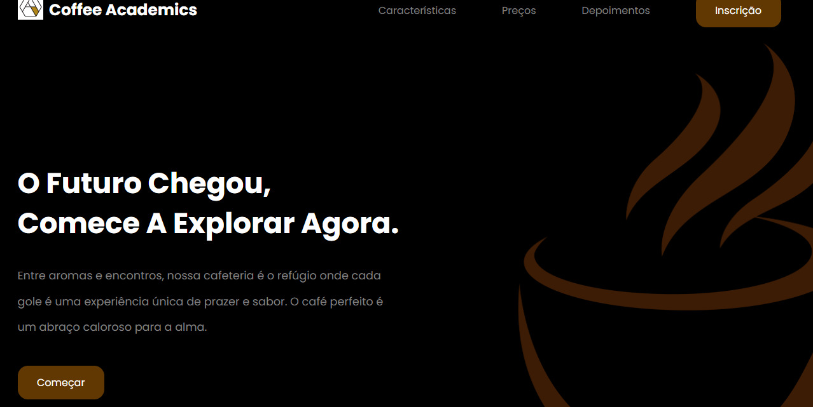

# Índice

* [Descrição do projeto](#📝-descrição-do-projeto)
* [Objetivos](#objetivos)
* [Estruturas de diretórios](#sites-de-e-commerce-utilizados)
* [Personalização](#personalização)
* [Linguagens utilizadas](#linguagens-utilizadas)
* [Ferramentas utilizadas](#ferramentas-utilizadas)
* [Fontes consultadas](#🌐fontes-consultadas)

# Landing Page

## 📝 Descrição do projeto

* Este projeto consiste na criação e implementação de uma Landing Page, uma página web dedicada a atrair, informar e converter visitantes em potenciais clientes ou leads. A Landing Page é uma ferramenta fundamental para apresentar de forma concisa e atrativa os principais aspectos de um produto, serviço ou oferta específica.

## Objetivos

* ATRATIVIDADE - Desenvolver uma interface visualmente apelativa para capturar a atenção dos visitantes.
* CONVERSÃO - Implementar elementos de persuasão e call-to-action para incentivar a interação e conversão.* * * INFORMAÇÃO CONCISA - Fornecer informações essenciais de forma clara e concisa, destacando os benefícios e diferenciais.

## Estrutura de diretórios

* ASSETS -  Contém os recursos visuais, como imagens e ícones
* CSS - Armazena os estilos CSS para personalização da página
* JS -  Contém scripts JavaScript para funcionalidades interativas
* DOCS -  Documentação relacionada à Landing Page.

## Personalização

* Substitua as imagens na pasta assets pelos recursos visuais desejados.
Ajuste o conteúdo em index.html conforme a mensagem que deseja transmitir.
Personalize o estilo editando arquivos em css.

## Linguagens utilizadas

* HTML5
* CSS3
* JavaScript

## Ferramentas utilizadas

* Git
* GitHub
* Markdown

## 🌐 Fontes consultadas

* [Responsive Landing Page Using HTML & CSS & JavaScript _ Tutorial]() - Vídeo no acervo do Marista Ir. Acácio
* [FontAwesome](https://fontawesome.com/).